# ShallWe 유저 테스트 결과

**진행자:** 윤찬웅  
**날짜:** 2026.05.05

---

## 테스트 대상

- 23세 남성, 대학교 3학년
- 자기계발 앱 써본 적 없음
- 최근 학업 스트레스로 무기력함을 느끼고 있음

---

## 시나리오 1 — 회원가입 후 챌린지 선택

| 온보딩 | 회원가입 |
|:---:|:---:|
| 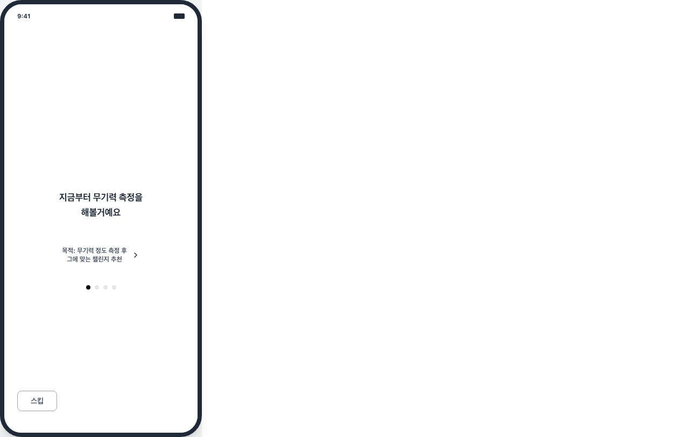 | 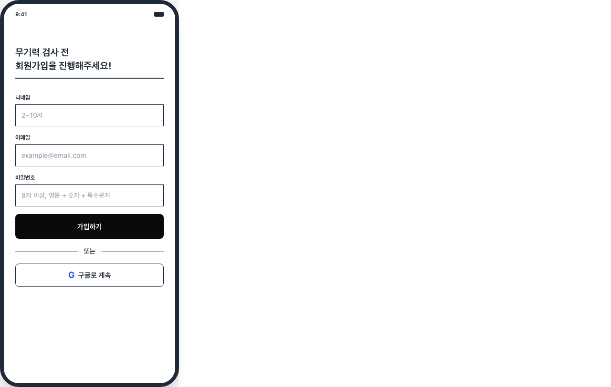 |

| 무기력 측정 | 결과 화면 |
|:---:|:---:|
| 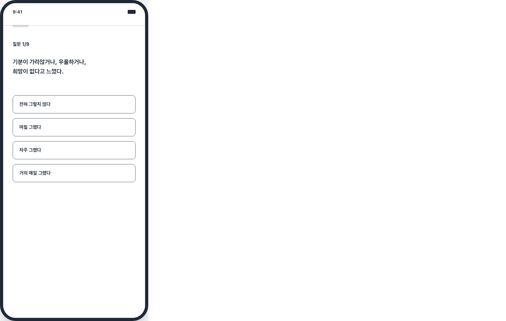 |  |

| 챌린지 선택 | 추가 완료 |
|:---:|:---:|
| 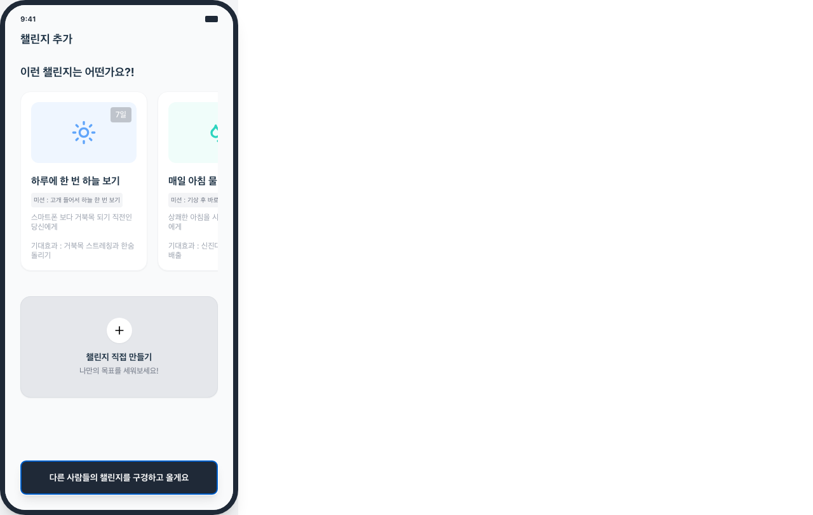 | 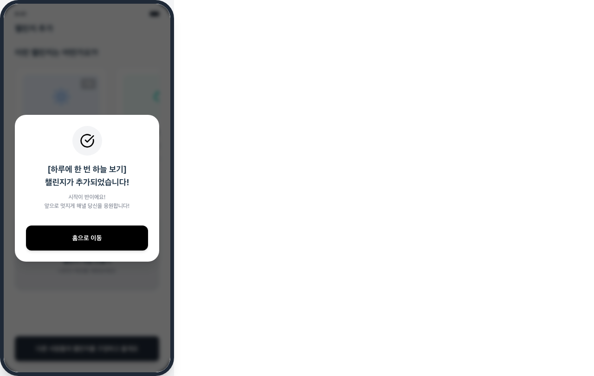 |

**관찰 내용**
- 온보딩 ">" 화살표가 너무 작아서 두세 번 눌러야 넘어감
- 9문항 다 답했는데 결과 화면에 점수가 안 나옴. "결과가 뭔데?" 하면서 화면 위아래로 스크롤함
- 챌린지는 "이게 더 쉬워보여서"라며 하늘 보기 선택

**문제점**
- 측정 결과 피드백 없음 → 왜 이 챌린지가 추천됐는지 모름
- 온보딩 화살표 터치 영역 너무 작음, 스와이프 안 됨
- 스킵 버튼이 좌하단이라 처음에 못 찾음

**발화:** "9개나 해야 돼?", "결과가 뭔데? 나 무기력한 거 맞아?"

---

## 시나리오 2 — AI 다이어리 감정 기록

| 다이어리 캘린더 | 기록 작성 |
|:---:|:---:|
| 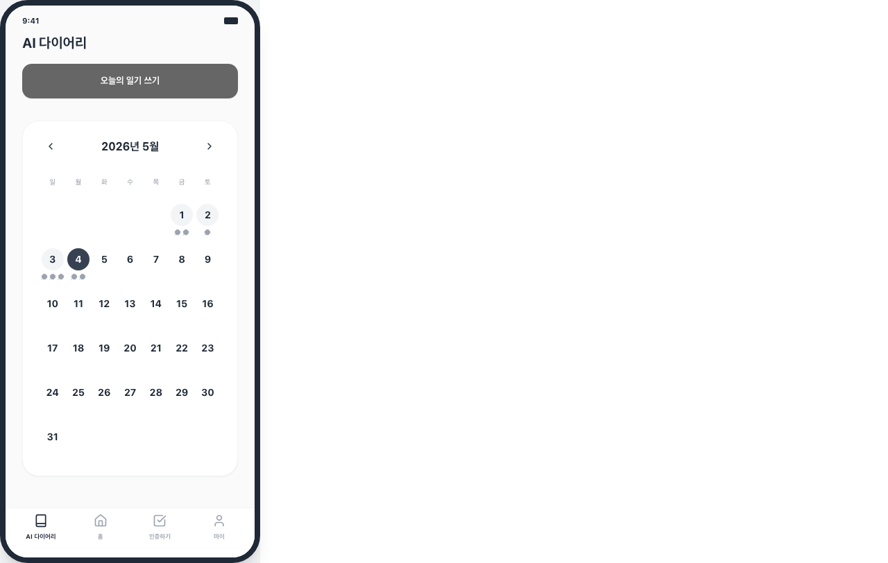 | 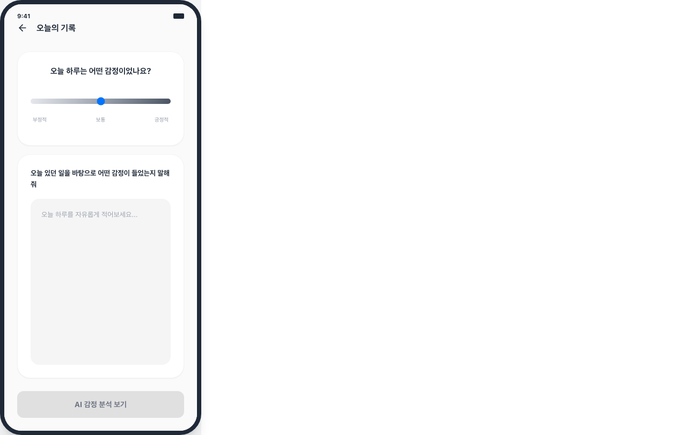 |

| AI 감정 분석 |
|:---:|
|  |

**관찰 내용**
- 캘린더에서 과거 날짜에 점이 찍혀있길래 눌러봤는데 아무 반응 없음
- 감정 슬라이더가 3단계뿐이라 "좀 애매한데" 하면서 고민
- AI 분석 보기 버튼이 회색이라 "이거 눌리는 거 맞아?" 하고 망설임
- 분석 결과에서 "과한 자책", "반추사고" 나오니까 "오 이런 것도 알아?" 하면서 놀람

**문제점**
- 감정 슬라이더 3단계로는 세밀한 표현 어려움
- AI 분석 버튼이 비활성처럼 보임
- 감정 분석 → 챌린지 추천이 갑자기 나와서 맥락이 끊김

**발화:** "이거 눌리는 거 맞아?", "오 반추사고가 뭔데... 아 그런 뜻이구나"

---

## 시나리오 3 — 챌린지 인증 및 공유

| 인증 화면 | 홈 (커뮤니티) |
|:---:|:---:|
| 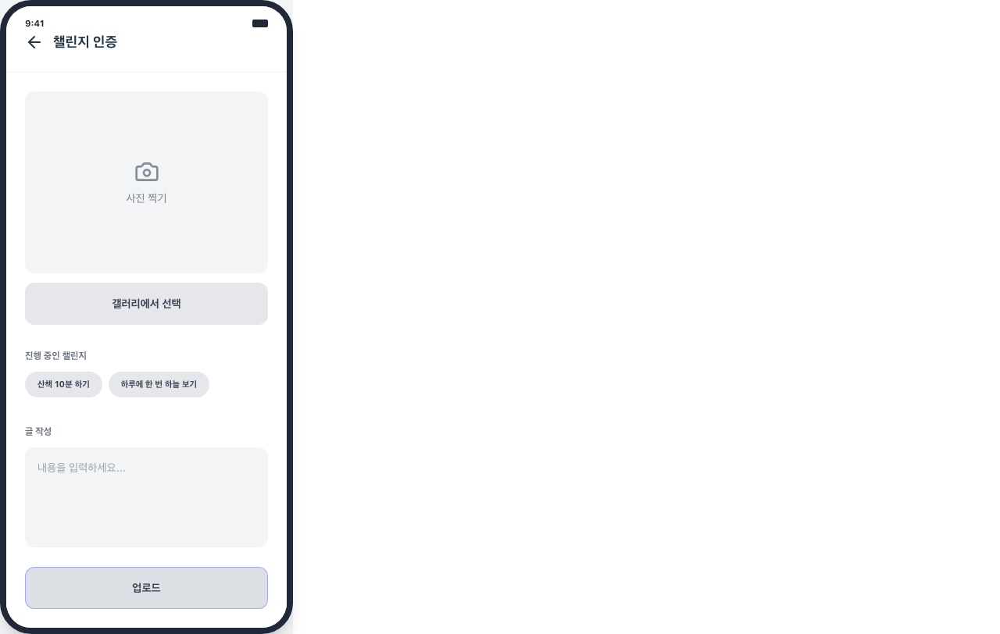 | 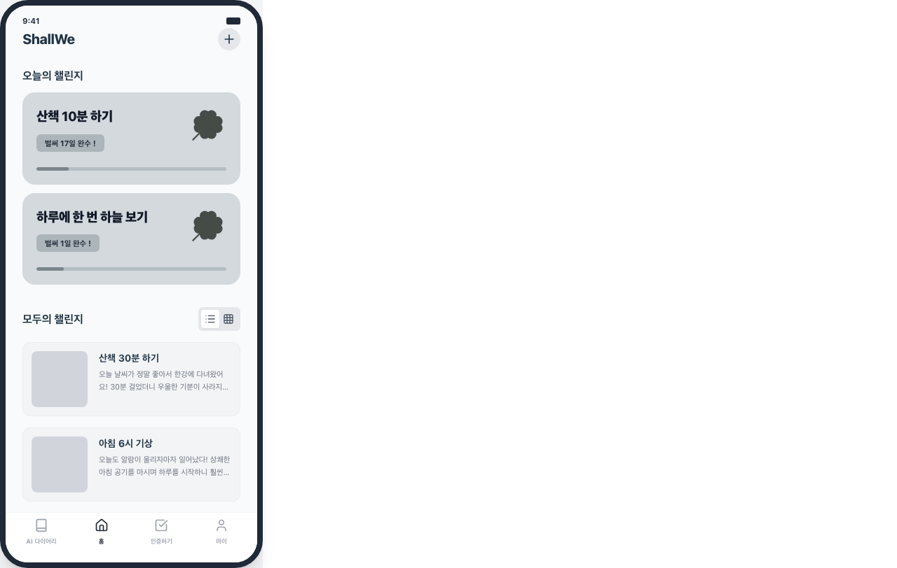 |

**관찰 내용**
- 챌린지 태그(산책 10분, 하늘 보기) 눌렀는데 선택된 건지 구분이 안 됨
- 글 쓰고 업로드 눌렀더니 아무 메시지 없이 홈으로 넘어감. "어? 된 거야?" 반응
- 커뮤니티 피드에서 다른 사람 글 보면서 "동기부여 되긴 한다"고 함

**문제점**
- 태그 선택 시 시각적 피드백 없음
- 업로드 완료 메시지가 아예 없음 → 성공 여부 확인 불가
- 사진 없이도 인증 가능 → 인증 신뢰도 떨어짐

**발화:** "이거 선택된 거 맞아?", "된 거야? 완료 메시지 같은 거 없어?"

---

## 시나리오 4 — 챌린지 기록 확인

| 마이페이지 | 챌린지 기록 |
|:---:|:---:|
| 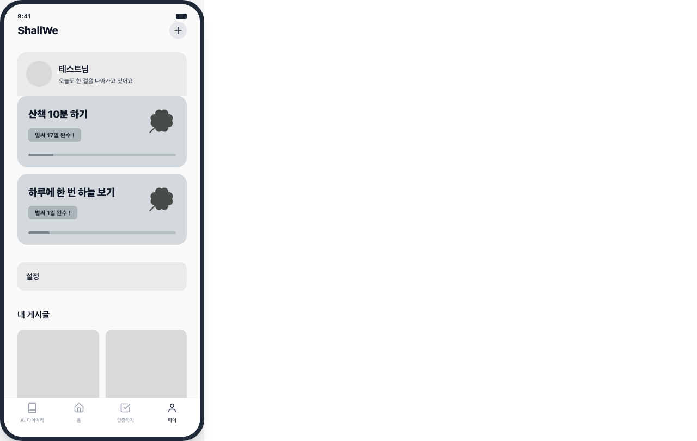 | 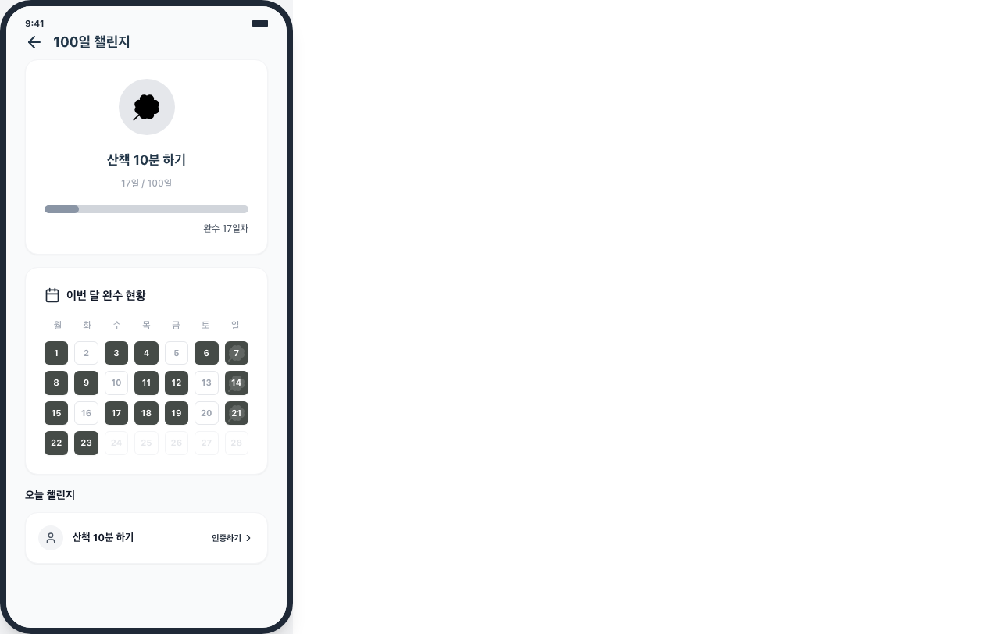 |

**관찰 내용**
- 캘린더에서 완수한 날이 진하게 표시된 걸 보고 "오 꽤 했네" 하면서 좋아함
- 근데 바로 "이거 연속으로 한 거야?" 하고 물어봄. 연속 달성 정보가 없어서 모름
- 17/100 프로그레스바 보고 "아직 멀었다..." 하면서 기 죽은 표정

**문제점**
- 연속 달성 일수 표시 없음
- 100일 기준 프로그레스바가 오히려 의욕 꺾음
- 과거 달 기록 확인 방법 불명확

**발화:** "오 꽤 했네 나", "연속으로 한 거야 중간에 빠진 거야?", "아직 멀었다..."

---

## 개선 우선순위

| 순위 | 항목 | 이유 |
|:---:|------|------|
| 1 | 무기력 측정 결과 피드백 | 앱 핵심 가치인데 결과를 안 보여줌 |
| 2 | 인증 완료 피드백 추가 | "된 거야?" 반응은 UX 실패 |
| 3 | 연속 달성/주간 통계 | 성취감이 리텐션 핵심 |
| 4 | 온보딩 터치 영역 확대 | 첫인상에서 이탈 가능 |
| 5 | AI 분석→챌린지 추천 연결 | 맥락 없이 갑자기 나옴 |
| 6 | 감정 슬라이더 세분화 | 3단계로는 부족 |
